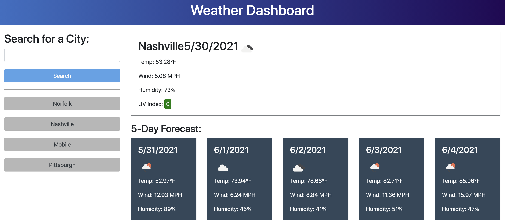

# Weather Dashboard

A weather dashboard that saves your search history for easy future reference.

## Site Link

<https://twyllblackleaf.github.io/weather-dashboard/>

## Features

- Search for cities and addresses in the USA and Canada
- Shows current weather and a five-day forecast
- Saves search history in localStorage and displays previously searched cities as buttons for easy access

## Technologies used 

- Geocod.io (geocoding API)
- OpenWeather's One Call API (weather data)
- Bootstrap (styling)
- Moment.js (handling dates in JavaScript)

## About Me

I'm a web developer who’s hungry for knowledge– and for opportunities to apply that knowledge as a programmer to enhance user experience; improve accessibility and security; and create stable, well-crafted, and elegantly functional code. I have a bachelor’s degree in English from Vanderbilt University and a certificate from Vanderbilt University Coding Boot Camp, a full-stack web development boot camp where I worked with JavaScript, HTML5, CSS, Node.js, Express, MySQL, Sequelize, MongoDB, and React.

With my background in English, passion for psychology, and lived experience with disability and neurodivergence, along with my love of learning for learning’s sake, I bring value to any team through supporting others, enhancing communication between team members, and quickly picking up technologies needed for the project.

In my spare time, I run games of Dungeons and Dragons, which provides a lot of experience with managing interpersonal interactions, considering and making deliberations on technical questions, and herding cats!
